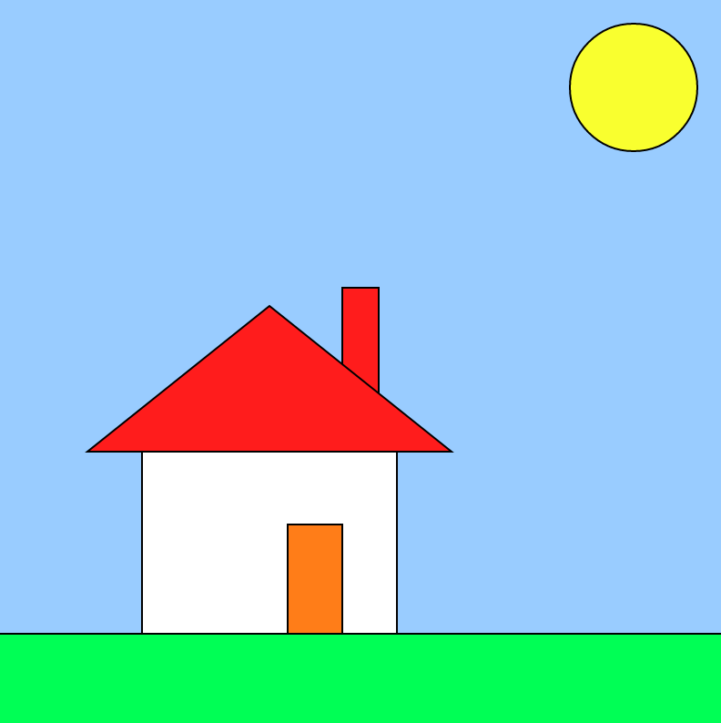

## 2020年度 プログラミング部

## p5.js 学習

### Step1: `setup()`と`draw()`関数を理解しよう

* `setup()`: プログラムが始まったときに呼ばれる関数
* `draw()`: `setup()`直後に呼ばれる関数　プログラムが終了するまで呼ばれ続ける関数（フレームレートの早さで呼ばれ続ける）

### Step2:[ `createCanvas(w, h)`](https://p5js.org/reference/#/p5/createCanvas)を理解しよう

*  `createCanvas(w, h)`: HTMLドキュメントに描くためのキャンバスを作成する関数
  * `w`: 幅（ピクセル）
  * `h`: 高さ（ピクセル）

### Step3: [`background()`](https://p5js.org/reference/#/p5/background)を理解しよう　RGB色を理解しよう

* `background(gray)`

  * `gray` : 0 ~ 255 までの数字を入れると黒〜白を表現する

* `background(r, g, b)`

  * `r` : 0 ~ 255 赤の数字
  * `g` : 0 ~ 255 緑の数字
  * `b` : 0 ~ 255 青の数字

  

### Step4:[ `ellipse()`](https://p5js.org/reference/#/p5/ellipse)を使って円を描こう

* `ellipse(x, y, w, h)`
  * `x` : x座標
  * `y` : y座標
  * `w` : 幅
  * `h` : 高さ

### Step5:[ `fill()`](https://p5js.org/reference/#/p5/fill)を使って円の塗りつぶしの色を変えよう

* `fill(gray)` : 形の塗りつぶしの色を設定する関数
  * `gray` : 0 ~ 255 までの数字を入れると黒〜白を表現する
* `fill(r, g, b)` : 形の塗りつぶしの色を設定する関数
  * `r` : 0 ~ 255 赤の数字
  * `g` : 0 ~ 255 緑の数字
  * `b` : 0 ~ 255 青の数字

### Task: 簡単な絵を描こう

* `ellipse()`, `rect()`, `fill()`, `background()`を使って絵を描こう

