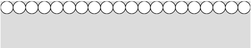
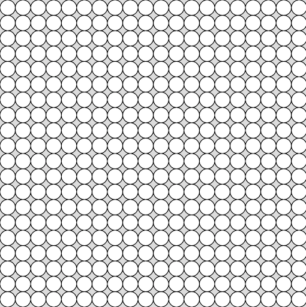

## 2020年度 プログラミング部

## p5.js 学習

### Step6: 変数(variable)を使おう 

* 変数は３つあります。
  * `let` 変数の中身が変わるものならばこれを使用する
    * ex. `let x = 10`
  * `const` 変数が変わらないものはこれを使用する
    * ex. `const x = 3.14`
  * `var` ＊これは昔のJavascriptの変数の定義方法（あまり使わないほうが良い）


#### Task: 変数を使って四角を描こう

* 四角のサイズに変数を使って定義すること

```js
???? // ここに変数を定義

function setup() {
  createCanvas(400, 400);
}

function draw() {
  background(220);
  rect(200, 200, ?????)  // ここで変数を使用
}
```


---


### Step7: 関数(function)を作ろう

* 関数とはタスクや計算などを実行するコードの集まり。
* 定義するには `function`キーワードを使う。
* `function`には「引数」(argument)を定義することができる。引数は作った関数を呼び出す時に関数に与える値である。
  * ex. `function myAdd(x, y) { return x + y}`
  * 上記の例で使用されている`return `は関数から戻す値の前に置く


#### Task: 四角を描くfunctionを作ろう

* 四角を描く関数で、大きさは決まった大きさだけど、場所を引数として与えられるものを作ろう

```js
function setup() {
  createCanvas(400, 400);
}

function draw() {
  background(220);
  
  myRect(50, 50) // 自分の作った関数を呼び出そう
  myRect(100, 100)
}


function myRect(????) {
  rect(????)
}
```


### Step8: forループを使おう

* for文を使うことによってコンピュータが得意な繰り返しをすることができます。

```js
for ([変数初期値]; [繰り返す条件]; [加算式]) {
  // ここに繰り返すコードを書く
}
```

* 例えば、1から10まで数えるfor文を作ると
  * 変数初期値： `let i = 1` (初期値は1)
  * 繰り返す条件： `i<=10`  (10以下のうちは繰り返す)
  * 加算式： `i = i + 1`  (変数`i`自身に`10`を足す)  ( `i++` でも同じ表現が可能！)

```js
for (let i=1; i<=10; i = i+1) {
  console.log(i)
}
```

* `console.log()`はコンソールに結果を表示するための指示（よく使うので覚えよう）


例えば、10から100まで10ずつ足していくfor文は

* 変数初期値： `let i = 10` (初期値は10)
* 繰り返す条件： `i<=100`  (100以下のうちは繰り返す)
* 加算式： `i = i + 10`  (変数`i`自身に`10`を足す)

```js
for (let i=10; i<=100; i = i+10) {
  console.log(i)
}
```


#### Task1: 円をfor文を使ってたくさん描こう「横一行」

* 四角を描く関数で、大きさは決まった大きさだけど、場所を引数として与えられるものを作ろう

```js
function setup() {
  createCanvas(400, 400);
}

function draw() {
  background(220);
  
  for (???; ???; ???) {
    circle(???)
  }
}
```





#### Task2: 円をfor文を使ってたくさん描こう「縦横画面いっぱい」

* 今度は横一行ではなく、画面下にもfor文を使って縦いっぱいに円を描こう。
* ポイントはfor文の中にfor文を書くこと！

```js
function setup() {
  createCanvas(400, 400);
}

function draw() {
  background(220);

  for (???; ???; ???) {
    for (???; ???; ???) {
      circle(???)
    }
  }
}

```

