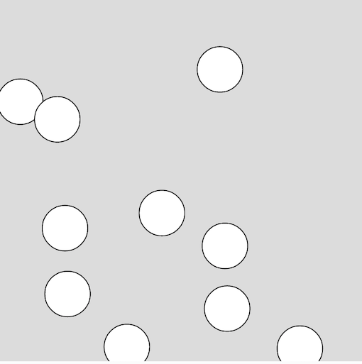

## 2020年度 プログラミング部

## p5.js 学習

### Step11: Ballをたくさん描こう

* Arrayを使うことによりたくさんの円を描こう

Arrayの中身を呼び出す方法

```js
let myArray = ['a', 'b', 'c']

console.log(myArray[0]) // 'a'
console.log(myArray[1]) // 'b'
console.log(myArray[2]) // 'c'
```


Arrayに値を追加する方法

```js
let myArray = []
myArray.push('x')
myArray.push('y')

console.log(myArray[0]) // 'x'
console.log(myArray[1]) // 'y'
```


#### Task: Ballをたくさん描こう

##### Hint: 


* `balls`変数を作り、それを空のArrayを割り当てよう
* `setup()`に`Ball`インスタンスをfor文を使ってたくさん初期化しよう
  * 引数(`x`,`y`,`speed`)に変化をつけるために`random()`関数を使おう
  * `random([最低値], [最高値])`  : 最低値と最高値の間の値をランダムで出力
* `draw()`に`balls`変数の中にある`Ball`インスタンスをfor文を使って描こう


```js
let balls = []

function setup() {
  createCanvas(400, 400);

  // !! ここでBallインスタンスを作成
  for (???; ???; ???) {
    balls.push(new Ball(
      random(???, ???),
      random(???, ???),
      random(???, ???)
    ))
  }
}

class Ball {
  // ここは以前と同じ
}

function draw() {
  background(220);

  // !! ここでBallを描く
  for (???; ???; ???) {
    ???.update()
    ???.edges()
    ???balls[i].show()
  }
}
```



# [sketch](https://editor.p5js.org/sf_/present/LQKB40nGO)