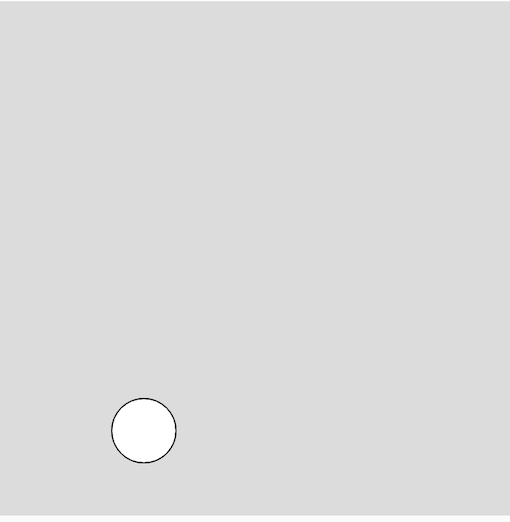

## <span style="background: #1aafd0">2020年度 プログラミング部</span>

## p5.js 学習

### Step13: Vectorを使って座標、動きを表現しよう

* `Vector`を使うと、座標の位置、動きを簡単に計算できるようになる
* `createVector()`関数でベクトルオブジェクトを作成する
  * `createVector([x座標(向き)], [y座標(向き)])`
* `Vector`オブジェクト
  * `x` プロパティがある
  * `y`プロパティがある
  * `Vector`同士を足すには`.add()`メソッドがある

```js
let pos = createVector(5, 2) // Vectorオブジェクトの生成・初期化
console.log(pos.x) // Vectorオブジェクトのxプロパティを確認
console.log(pos.y) // Vectorオブジェクトのyプロパティを確認

let speed = createVector(2, 4)
console.log(pos.add(speed)) // posベクトルとspeedベクトルを足す
```


#### Task1: VectorでBallを動かそう

##### Hint: 


* `createVector`で`pos`プロパティを作成(このベクトルで`x`と`y`を管理)
* `update()`メソッドは`Vector`同士を足し合わせる
* `edges()`メソッドは`x`と`y`を比較する


```js
// Step13
// Vectorを使う
// BallのプロパティposをVectorに変更
// BallのプロパティspeedをVectorに変更

let ball

function setup() {
  createCanvas(400, 400);
  ball = new Ball()

}

class Ball {
  constructor() {
    this.pos = createVector(???)
    this.speed = createVector(???)
    this.r = 50
  }

  show() {
    circle(???, ???, this.r)
  }

  update() {
    this.???.add(???)
  }

  edges() {
    if (this.??? >= 400 && this.??? > 0) {
      this.??? = this.??? * -1
    }
    if (this.??? < 0 && this.??? < 0) {
      this.??? = this.??? * -1
    }

    if (this.??? >= 400 && this.??? > 0) {
      this.??? = this.??? * -1
    }
    if (this.??? < 0 && this.??? < 0) {
      this.??? = this.??? * -1
    }
  }
}

function draw() {
  background(220);

  ball.update()
  ball.edges()
  ball.show()

}
```



# [sketch](https://editor.p5js.org/sf_/present/5NjqwWjS2)


#### Task2: VectorでたくさんのBallを動かそう

##### Hint: 


* `step12`で書いたsketchをベクトルを使って表現しよう


```js
// Step13

let balls = []
const NUM_BALLS = 30

function setup() {
  createCanvas(400, 400);

  // !! ここでBallインスタンスを作成
  for (let i = 0; i < NUM_BALLS; i++) {

    // posベクトルを生成
    let pos = createVector(???)

    // speedベクトルを生成
    let speed = createVector(???)
    
    // r直径をランダムに生成
    let r = random(10, 100)

    // balls配列に初期化したBallを足す
    balls.push(new Ball(???, ???, ???))
  }
}

class Ball {
  constructor(???, ???, ???) {
    this.pos = ???
    this.speed = ???
    this.r = ???
  }

  show() {
    circle(this.pos.x, this.pos.y, this.r)
  }

  update() {
    this.???.add(this.???)
  }

  edges() {
    if (??? && ???) {
      this.speed.x = ??? * -1
    }
    if (??? && ???) {
      this.speed.x = ??? * -1
    }

    if (??? && ???) {
      this.speed.y = ??? * -1
    }
    if (??? && ???) {
      this.speed.y = ??? * -1
    }
  }
}


function draw() {
  background(220);

  // !! ここでBallを描く
  for (let i = 0; i < NUM_BALLS; i++) {
    balls[i].update()
    balls[i].edges()
    balls[i].show()
  }
}
```


# [sketch](https://editor.p5js.org/sf_/sketches/LxIk8EaPw)


