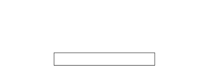

## <span style="background: #1aafd0">2020年度 プログラミング部</span>

## p5.js 学習

### Step14: Paddleクラスを作ろう

* `Paddle`はボールを跳ね返すためのラケット
* p5jsの`rect()`functionを使って長方形で表現しよう


#### Task1: Paddleクラスの作成

##### Hint: 


* `Paddle`クラスのプロパティ

  * `w`：幅の値
  * `h`：高さの値
  * `pos`：`Vector`で位置を表現（ `pos`の中に`x`と`y`の値がある）
* `Paddle`クラスのメソッド

  * `display()`：`rect()`functionを表示（長方形を表示）


```js
// Step14-1
let paddle

function setup() {
  createCanvas(windowWidth, windowHeight)
  // Paddleクラスのインスタンスを作成
  paddle = new Paddle()
}

function draw() {
  background(255)

  // Paddleインスタンスのdisplay()を呼び出す（繰り返し）
  paddle.display()
}

class Paddle {
  constructor() {
    this.w = ??? // w = 幅
    this.h = ??? // h = 高さ

    // pos = 位置を示すVector
    this.pos = createVector(???, ???)
  }

  display() {
    // 長方形を表示
    rect(this.???, this.???, this.???, this.???)
  }
}

```



# [sketch](https://editor.p5js.org/sf_/sketches/T6Bv72s7X)


#### Task2: Paddleをキーボードを使って動かそう

##### Hint: 


* p5jsの`keyPressed()`, `keyReleased()`を利用しよう

  * `keyPressed()`：ユーザーのキーボードが押された時に呼び出される
  * `keyReleased()`：ユーザーがキーボードのキーを離した時に呼び出される
* `Paddle`クラス

  * `Paddle`クラスにプロパティ`isMovingRight`と`isMovingLeft`を定義しよう

    * ``isMovingRight`と`isMovingLeft`のタイプはBooleanタイプ（`true`と`false`の２種類がある）
  * `Paddle`クラスの`update()`と`checkEdges()`を定義しよう

    * `update()`

      * 補助functionの`move()`を定義しよう

        * 引数の`step`を受け取りその`step`分右と左に動く
      * `update()`の中に`move()`を使おう

        * `isMovingRight`と`isMovingLeft`プロパティで`move()`に`20`か`-20`を渡すかを判断しよう
    * `checkEdges()`

      * `Paddle`が画面外に移動しないように確認

        * `pos.x`プロパティを監視して判断


```js
// Step 14-2
let paddle

function setup() {
  createCanvas(windowWidth, windowHeight)
  // Paddleクラスのインスタンスを作成
  paddle = new Paddle()
}

function draw() {
  background(255)

  // Paddleインスタンスのdisplay(), update(), checkEdges()を呼び出す（繰り返し）
  paddle.display()
  paddle.update()
  paddle.checkEdges()
}

function keyPressed() {
  if (key === "a" || key === "A") {
    // キーボードのaもしくはAが押された時にPaddleインスタンスのi isMovingRight を true に変更
    paddle.isMovingLeft = ???
  } else if (key === "d" || key === "D") {
    // キーボードの d もしくは D が押された時にPaddleインスタンスのi isMovingLeft を true に変更
    paddle.isMovingRight = true
  }
}

function keyReleased() {
  // キーボードのキーを押しているのを離したら Paddleインスタンスの isMovingLeft, isMovingRight を false に変更
  paddle.isMovingLeft = false
  paddle.isMovingRight = ???
}

class Paddle {
  constructor() {
    this.w = 160 // w = 幅
    this.h = 20 // h = 高さ

    this.isMovingLeft = false // 左に動いているか Boolean
    this.isMovingRight = false // 右に動いているか Boolean

    // pos = 位置を示すVector
    this.pos = createVector(width / 2, height - 40)
  }

  display() {
    // 長方形を表示
    rect(this.pos.x, this.pos.y, this.w, this.h)
  }

  move(step) {
    // 動きを司る関数 pos.x （横位置） に 引数として渡す step の量を動かす
    this.pos.x += step
  }

  update() {
    if (this.???) {
      // もし、 isMovingRight が true だとしたら右に 20ピクセル動かす
      this.move(20)
    } else if (this.???) {
      // もし、 isMovingLeft が true だとしたら左に 20ピクセル動かす
      this.move(-20)
    }
  }

  checkEdges() {
    // 画面外に移動しないように工夫
    if (this.pos.x < ???) {
      // もし、pos.x の位置が左画面外に移動したら、位置を画面左端に戻す
      this.pos.x = 0
    } else if (this.??? > width - this.w) {
      // もし、Paddleの右端が画面右端に移動したら、位置を画面右端に戻す
      // ＊ pos.xはPaddleの左上の位置を示すので、右端を計算するにはPaddleの幅を足して計算をしなければならない
      this.pos.x = width - this.w
    }
  }
}

```


# [sketch](https://editor.p5js.org/sf_/sketches/kSFhT69Ao)


