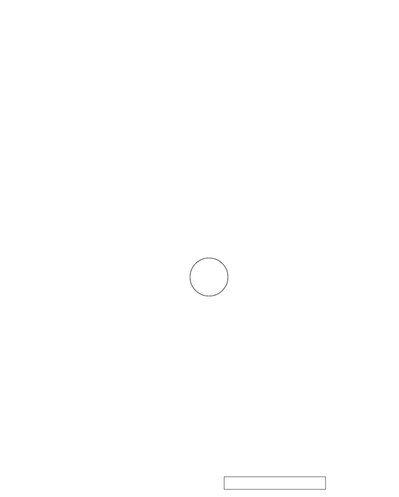

## <span style="background: #1aafd0">2020年度 プログラミング部</span>

## p5.js 学習

### Step15: Paddleからボールが跳ね返るようにしよう


#### Task1: Ballクラスに衝突判定をするメソッドを定義

##### Hint: 


* `Ball`クラスのプロパティ

  * `r`：ボールの直径
  * `direction`：方向を示す`Vector`
  * `vel`：動く強さ（速さ）を示す`Vector`
  * `.mult(5`)は動く方向に5をかけている

  * `pos`：`Vector`で位置を表現（ `pos`の中に`x`と`y`の値がある）

* `Ball`クラスのメソッド

  * `meets()`：`Paddle`に衝突したときの判定を担当　もし衝突していたら`true`を返す(`return `キーワードに注意！) そうでなければ`false`を返す


```js
// Step15-1
class Ball {
  constructor() {
    this.pos = createVector(width / 2, height / 2)
    this.r = 30

    this.direction = createVector(1, 1)
    this.vel = createVector(1, 1).mult(5)
  }

  display() {
    ellipse(this.pos.x, this.pos.y, this.r * 2, this.r * 2)
  }

  update() {
    this.pos.x += this.vel.x * this.direction.x
    this.pos.y += this.vel.y * this.direction.y
  }

  checkEdges() {
    if (this.pos.y < this.r && this.direction.y < 0) this.direction.y *= -1

    if (this.pos.x < this.r && this.direction.x < 0) this.direction.x *= -1

    if (this.pos.x > width - this.r && this.direction.x > 0)
      this.direction.x *= -1
  }

  // BallとPaddleが衝突している場合はtrueをreturnする
  meets(paddle) {
    if (
      this.pos.y < paddle.pos.y &&  // Ballの中心がPaddleの上端より小さい
      this.pos.y > paddle.pos.y - this.r &&  // Ballの中心がPaddleの上端からBallの直径を引いたものより大きい
      this.pos.x > paddle.pos.x - this.r &&  // Ballの中心がPaddleの左端からBallの直径を引いたものより大きい
      this.pos.x < paddle.pos.x + paddle.w + this.r  // Ballの中心がPaddleの右端(Paddleの左端+Paddleの幅)からBallの直径を足したものより小さい
    ) {
      return true
    } else {
      return false
    }
  }
}


```

#### Task2: draw関数の調整

##### Hint: 


* `draw`関数
* `if`を使って`ball`の衝突判定をチェックする
  * 衝突している場合は`ball`の方向を逆方向にする


```js
function draw() {
  
  background(255)

  paddle.display()
  paddle.update()
  paddle.checkEdges()

  ball.display()
  ball.update()
  ball.checkEdges()

  // ballインスタンスのmeet()メソッドを呼び出し、衝突をしているかを判断
  // もし、衝突していたらballの方向(direction)を逆方向にする
  if (ball.meets(paddle) && ball.direction.y > 0) ball.direction.y *= -1
}
```




# [sketch](https://editor.p5js.org/sf_/sketches/ZbRAqdJX3)


