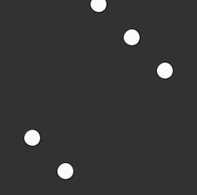

## <span style="background: #1aafd0">2020年度 プログラミング部</span>

## p5.js 学習

### Step18: 雪をたくさん降らせよう


#### Task: たくさん雪を表示する

##### Hint: 
* 

```js
// Step18
let snowList = []
let gravity  // 重力を表すVector

function setup() {
  createCanvas(400, 400)
  // 重力を表すVector（0.1の強さで下方向に加速）
  gravity = ???(0, 0.1) // Vectorを作成
}

function draw() {
  background(0)
  snowList.push(new Snow())

  for (let snow of snowList) {
    snow.update()
    snow.draw()
  }
}

class Snow {
  constructor() {
    let x = random(width)
    let y = random(???, ???) // 画面上部外からsnowが作成される
    this.pos = createVector(x, y)
    this.vel = createVector(0, 0) // 最初は速度を表すVectorは0
    this.acc = createVector() // 加速を表すVector
  }

  update() {
    this.acc = gravity // 加速Vectorに重力Vectorを設定する
    this.vel.add(???) // 速度Vectorに加速Vectorを足す
    this.pos.add(???) // 位置Vectorに速度Vectorで動いた分を足す
  }

  draw() {
    stroke(255)
    strokeWeight(4)
    point(this.pos.x, this.pos.y)
  }
}


```



# [sketch](https://editor.p5js.org/sf_/present/HDnVcAZac)


