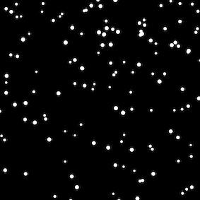

## <span style="background: #1aafd0">2020年度 プログラミング部</span>

## p5.js 学習

### Step19: 雪に重力を加えよう


#### Task: 

* 加速Vectorを加える
* 雪のサイズをランダムに表示
* 画面外にで雪を`snowList`から消す (`offScreen()`メソッド)

##### Hint: 

* `applyForce()`メソッドを定義：
  *  Vectorであるforceを受け取り、加速プロパティ(this.acc)に加える
  * 毎フレーム、`this.acc`を初期化する(`this.acc.mult(0)`で加速に0を掛けて初期化する)
* 

```js
// Step19
let snowList = []
let gravity

function setup() {
  createCanvas(400, 400)
  gravity = createVector(0, 0.02)
}

function draw() {
  background(0)
  snowList.push(new Snow())

  for (snow of snowList) {
    snow.applyForce(gravity) // applyForceメソッドで重力を加える
    snow.update()
    snow.draw()
  }

  // 画面外に出たsnowインスタンスを消す
  // ！forループが後ろから始まっているのがポイント！
  // はじめからループしてしまうとエラーが発生してしまう！
  for (let i = snowList.length - 1; i >= 0; i--) {
    if (snowList[i].???()) {
      // offScreenメソッドを呼び出し、画面外にある場合はtrueを返す
      snowList.splice(i, 1) // 配列のi位置にあるものを1つ配列から消す
    }
  }
}

class Snow {
  constructor() {
    let x = random(width)
    let y = random(-100, -10)
    this.pos = createVector(x, y)
    this.vel = createVector(0, 0)
    this.acc = createVector()
    this.r = ???(4, 8) // 雪の大きさをランダムに生成
  }

  // Vectorであるforceを受け取り、加速プロパティ(this.acc)に加える
  applyForce(force) {
    this.acc.add(force)
  }

  update() {
    this.vel.add(this.acc)
    this.pos.add(this.vel)
    // 加速Vectorを毎回初期化する
    // これをしなければ、毎回加速Vectorの強さが増えてしまう
    this.acc.mult(0)
  }

  draw() {
    stroke(255)
    strokeWeight(this.r) // 雪の大きさ
    point(this.pos.x, this.pos.y)
  }

  // 画面外に出た場合はtrueを返す そうでなければfalse
  offScreen() {
    return this.pos.??? > height + this.r
  }
}


```



# [sketch](https://editor.p5js.org/sf_/present/yLIxWuhJx)


